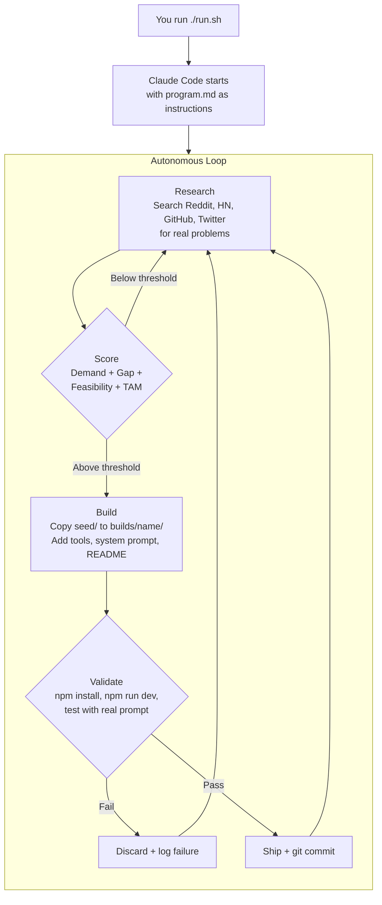

# agent-factory

An autonomous system that discovers real problems, builds AI agents to solve them, and ships them — while you sleep.

You give it API keys and a strategy file (`program.md`). It uses [Claude Code](https://docs.anthropic.com/en/docs/claude-code) to research problems from Reddit, HN, GitHub, and Twitter, score them on demand and market size, build standalone agents on a shared harness, validate they work, and commit them to `builds/`. Overnight, unattended.

Inspired by [Karpathy's autoresearch](https://github.com/karpathy/autoresearch) — same autonomous loop, applied to building agents instead of optimizing training runs.

## How It Works



`run.sh` launches Claude Code in headless mode. When Claude Code hits its context limit, `run.sh` automatically restarts it with a handoff note so it picks up where it left off. The loop runs indefinitely.

## What You Get

After an overnight session, you'll find:

- **Shipped agents** in `builds/` — each a self-contained Next.js app you can run with `npm run dev`
- **Scored research** — documented problem analyses with sources, market data, and gap validation
- **Build results** — every attempt (shipped or failed) logged in `results.tsv`
- **Meta-reflections** — the agent reviews its own patterns every 5 builds and adjusts strategy

Example agents built so far:

| Agent | What it does |
|-------|-------------|
| `freelancer-deduction-finder` | Finds tax deductions freelancers are missing — no bank connection required |
| `wage-rights-advisor` | FLSA exemption analysis, state wage law research, overtime calculation |
| `data-broker-opt-out` | Personalized opt-out plans to remove your data from brokers |
| `consumer-complaint-advisor` | Routes complaints to the right agencies, drafts letters, escalation strategy |
| `property-tax-appeal-advisor` | Determines if you're overassessed, finds comps, drafts appeal letters |
| `dep-changelog-summarizer` | Summarizes breaking changes in your npm dependency updates |

20 agents shipped and counting. Each one is a standalone repo you can clone and run independently.

## Prerequisites

- [Claude Code](https://docs.anthropic.com/en/docs/claude-code) — Anthropic's CLI agent (this is what runs the loop)
- **Node.js 18+** — the seed harness and built agents are Next.js apps
- [OpenRouter API key](https://openrouter.ai/keys) — LLM provider for the built agents
- [Composio API key](https://composio.dev) — gives built agents access to 250k+ APIs at runtime

## Quick Start

```bash
# Clone
git clone https://github.com/Dominien/agent-factory
cd agent-factory

# Configure API keys
cp .env.example .env
# Edit .env — add your OpenRouter and Composio keys

# Install seed harness dependencies
cd seed && npm install && cd ..

# Start the autonomous loop
./run.sh
```

That's it. Claude Code reads `program.md`, checks the seed harness, reviews any existing research, and enters the loop. Leave it running overnight.

To run a single session manually instead:

```bash
claude -p --dangerously-skip-permissions --verbose \
  "Read program.md fully. Read seed/README.md. Check .env, results.tsv. Begin the loop. NEVER STOP."
```

## How the System Works

Three moving parts:

**`program.md`** is the strategy file. It tells Claude Code where to research, how to score problems, how to build agents, and what quality bar to enforce. This is the only file you edit to change the system's behavior. It's natural-language instructions, not code.

**`seed/`** is the agent template. A minimal Next.js app with a hand-written agentic loop, multi-provider LLM support, and 7 built-in tools. When the system builds a new agent, it copies `seed/` to `builds/<agent-name>/` and customizes the tools, system prompt, and README. The seed is read-only — it never gets modified.

**`run.sh`** is the runner. It launches Claude Code, auto-restarts on context limits with a handoff note, and pipes logs. That's all it does.

### The Loop in Detail

1. **Research** — Claude Code searches Reddit, HN, GitHub, and Twitter for problems people complain about. It looks for frequency (many people asking), gap (no good free solution exists), and feasibility (solvable with web search + APIs + LLM processing).

2. **Score** — Each problem gets a Venture Score (6-point checklist) and a TAM estimate (total addressable market, log scale 0–5). The composite score is `venture x TAM`. New ideas must beat the current highest composite to enter the build queue — the bar keeps rising over time.

3. **Build** — Copy `seed/` to `builds/<name>/`. Write specialized tools in `lib/tools/`. Write the system prompt in `config.ts`. Write a README. Register tools in the API route.

4. **Validate** — Run `npm install && npm run dev`. Send a test prompt. If it produces useful output, ship it. If not, discard and log the failure.

5. **Ship** — Git commit the agent. Update `results.tsv`. Every 5 builds, write a meta-reflection on what patterns work and what keeps failing.

6. **Repeat** — Go back to research. The threshold ratchets up, forcing better ideas over time.

### The Seed Harness

7 built-in tools that cover the full workflow:

| Tool | Key Required | What it does |
|---|---|---|
| `web_search` | — | DuckDuckGo search |
| `web_fetch` | — | Fetch and extract readable content from URLs |
| `file_write` | — | Save reports and artifacts to disk |
| `file_read` | — | Read local files |
| `composio_search_tools` | `COMPOSIO_API_KEY` | Discover any of 250k+ API tools by description |
| `composio_execute_tool` | `COMPOSIO_API_KEY` | Execute a discovered tool with JSON arguments |
| `composio_manage_connections` | `COMPOSIO_API_KEY` | Check or initiate auth connections for services |

A single Composio key replaces all individual API keys — the agent discovers and calls tools at runtime.

Supports 4 LLM providers: **OpenRouter** (default), Anthropic, OpenAI, and Ollama. Switch by changing `PROVIDER` and `MODEL` in `.env`.

No framework dependencies. No LangChain, no CrewAI. Hand-written orchestration loop.

## Repo Structure

```
agent-factory/
├── program.md              # Strategy file — edit this to change behavior
├── run.sh                  # Runner — launches Claude Code, auto-restarts
├── .env.example            # API keys template (OpenRouter + Composio)
├── seed/                   # Agent template (read-only)
│   ├── lib/tools/          # 7 built-in tools
│   ├── lib/orchestrator.ts # Agentic loop engine
│   ├── config.ts           # System prompt + model config
│   └── ...                 # Full Next.js app
├── builds/                 # Shipped agents (each is standalone)
│   ├── freelancer-deduction-finder/
│   ├── wage-rights-advisor/
│   ├── data-broker-opt-out/
│   └── ...
├── research/               # Generated at runtime (gitignored)
└── .gitignore
```

Research data (`research/`, `results.tsv`, `build-queue.md`) is generated at runtime and gitignored. The public repo contains the system (`program.md`, `seed/`, `run.sh`) and the shipped agents (`builds/`).

## Customizing

Everything the agent does is controlled by `program.md`. Edit it to change:

- **Research sources** — add subreddits, forums, data sources
- **Scoring formula** — adjust TAM scale, composite threshold, diversity constraints
- **Quality bar** — raise or lower the venture score required for shipping
- **Anti-patterns** — block problem categories the agent keeps gravitating toward
- **Build process** — change how agents are structured, validated, or documented

The agent reads `program.md` at the start of every session and follows it autonomously. No code changes needed.

## Design Principles

1. **Local-first** — No databases, no hosted state. Files + git.
2. **Self-contained agents** — Each one: clone, add `.env`, `npm run dev`. Done.
3. **Research is a product** — Even failed builds produce documented knowledge.
4. **Threshold ratchet** — The bar keeps rising. Forces better ideas over time.
5. **Ship imperfect** — Working beats perfect. Document limitations, move on.
6. **Right-size tools** — As many as the problem needs. Each does one thing well.

## License

MIT
